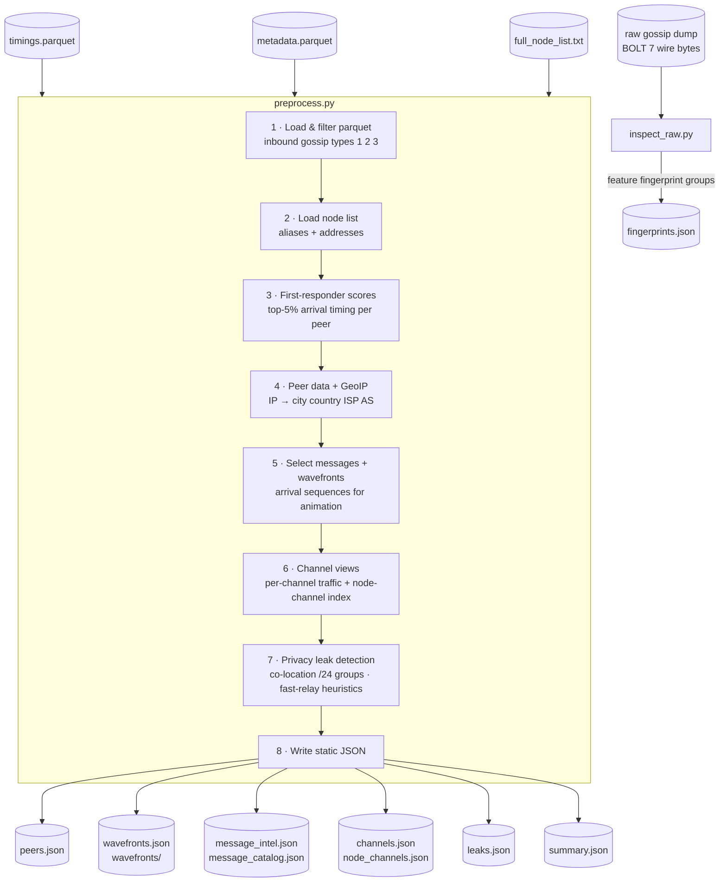

# LN Gossip Visualizer

A passive observability platform for the Lightning Network gossip layer. Ingests raw BOLT 7 gossip snapshots and produces an interactive intelligence dashboard for analyzing message propagation, peer behavior, and network-level privacy exposure.

No active probing. No node required. Operates entirely from passive timing and metadata collected at a single vantage point.

---

## What it does

The dashboard is organized into four panels that share a unified context model — selecting a message, node, or channel in any panel drives the others.

### 📡 Message Intelligence (Q1)
Browse all observed gossip messages (`channel_announcement`, `node_announcement`, `channel_update`). Select any message to inspect its propagation profile: origin node, timing spread, relay footprint, and spread classification (*broad + sustained*, *fast burst*, *relay-heavy*, *broad reach*, or *narrow / sparse*).

### 🌍 Geolocation Map (Q2)
World map of all peers with clearnet IPs. Markers are colored by community cluster (derived from SBM analysis). Zooms and highlights in response to context — selecting a node announcement zooms to that node; selecting a channel shows its top relay nodes.

### 🔗 Channels View (Q3)
Ranked channel list with per-channel traffic scores, relay footprint, and message type breakdown. Filters to the specific channel when a `channel_announcement` is selected in Q1. Clicking a channel card drives the node list in Q4.

### 🔬 Node Details (Q4)
Context-aware two-layer panel. The top layer shows a ranked node list that adapts to the active selection:
- **Message selected** → top 30 relay nodes for that channel (by `relay_messages`), or the announcing node for a `node_announcement`
- **Channel card clicked** → top 30 nodes active on that channel
- **No selection** → global top 30 fastest relayers by average arrival percentile

Clicking any node card drills into a full detail view:
- Network info (IP, ISP, AS, location, community)
- Fast relay heuristic flag (top-5% arrival timing)
- Co-location signal groups (/24 prefix overlap)
- Implementation fingerprint (feature bits, group size, known/unknown bits)

### 🛡️ Threat Indicator Bar
Persistent bottom bar surfacing four signal categories:
1. **Feature Risk Signals** — BOLT 9 feature bit exposure mapped to known attack surfaces (zero-conf theft, anchor replacement cycling, no backup protection, gossip DoS, UTXO exposure, wumbo targeting, channel downgrade)
2. **Spread Profile** — propagation classification for the selected message
3. **Co-Location Signals** — peer groups sharing a /24 subnet
4. **Fast Relay Heuristics** — peers consistently in the top 5% of arrival timing

Clicking any slot opens a detailed report card.

---

## Data pipeline



---

## Repository layout

```text
.
├── preprocess.py          # Main data pipeline (parquet → JSON)
├── inspect_raw.py         # Raw gossip decoder / feature fingerprinting
├── geolocate.py           # GeoIP enrichment helper
├── server.py              # Local static server
├── pyproject.toml
├── data/
│   ├── notes.md           # Manual community analysis notes
│   └── raw/
│       ├── node_lists/
│       │   └── full_node_list.txt     # JSON despite .txt extension
│       └── gossip_archives/
│           └── dump_0926T195046/
│               ├── timings.parquet/
│               ├── metadata.parquet/
│               └── messages.parquet/
└── static/
    ├── index.html          # Dashboard
    ├── app.js              # All dashboard logic
    ├── presentation.html   # Reveal.js slide deck
    ├── SPEAKER_NOTES.md
    └── data/               # Generated by preprocess.py + inspect_raw.py
        ├── peers.json
        ├── wavefronts.json
        ├── wavefronts/           # Per-message shards (on-demand load)
        ├── messages.json
        ├── message_intel.json
        ├── message_catalog.json
        ├── message_scope.json
        ├── channels.json
        ├── node_channels.json
        ├── channel_scope_summary.json
        ├── leaks.json
        ├── fingerprints.json
        ├── communities.json
        └── summary.json
```

---

## Quick start

1. Install dependencies:
   ```sh
   pip install -e .
   ```

2. Place the raw parquet exports under:
   ```
   data/raw/gossip_archives/dump_0926T195046/
   ```

3. Run the feature fingerprinter (generates `fingerprints.json`):
   ```sh
   python inspect_raw.py
   ```

4. Run the main pipeline (generates all other JSON):
   ```sh
   python preprocess.py
   ```

5. Serve and open the dashboard:
   ```sh
   python server.py
   ```

---

## Example dataset

The included static data represents a 24-hour passive observation window from a single vantage point:

| Metric | Value |
|---|---|
| Messages observed | 416,759 |
| Timing rows | 163,947,218 |
| Peers observed | 978 |
| Peers with clearnet IP | 758 |
| Tor-only peers | 220 |
| Fingerprinted nodes | 5,736 |
| Fast-relay heuristic peers | 33 |
| Co-location signal groups (/24) | 49 |
| Collection window | 23.5 hours |

The pipeline is dataset-agnostic — point it at any gossip parquet export and it will produce a fresh set of static JSON files for the dashboard.

---

## Notes

The parquet export is not included in the repo and must be restored separately before `preprocess.py` can be run end-to-end. The static JSON files in `static/data/` are pre-generated and sufficient to run the dashboard locally without re-running the pipeline.